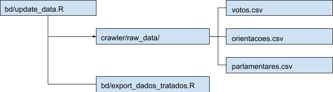
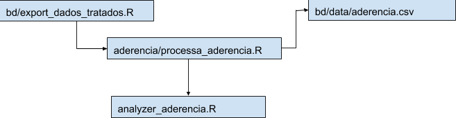

# Aderência  

Aderência no escopo deste projeto refere-se ao quanto um parlamentar é inclinado politicamente a votar/apoiar uma tendência/orientação. No presente momento, os cálculos realizados apenas estimam essa inclinação em apoio, ou não, ao governo. Desde forma geral e ampla, como também em relação a temas específicos (Meio Ambiente, Direitos Humanos, Integridade e Transparência, Agenda Nacional e Educação). Para isto, o voto do parlamentar é comparado com a orientação dada pelo governo em relação a cada votação, mostrando o índice de concordância, ou seja, quanto este voto acompanha a indicação dada pela liderança do Governo na Câmara ou no Senado.

## Sobre o cálculo   

A realização do cálculo de aderência se dá em etapas separadas ao longo do código, uma vez que, as informações necessárias estão dispersas em diversos módulos. Esta trajetória se inicia  no [bd/update_data.R](https://github.com/parlametria/perfil-parlamentar-dados/blob/master/bd/update_data.R), em que, são executados os módulos que fazem as exportações de dados para os csvs, os chamados exports, existentes no [crawler/raw_data](https://github.com/parlametria/perfil-parlamentar-dados/tree/master/crawler/raw_data), dentre estes se encontram os agentes principais do cálculo, votos.csv, orientacao.csv e parlamentares.csv. Além disso, o update_data.R também realiza a executação do [bd/export_dados_tratados.R](https://github.com/parlametria/perfil-parlamentar-dados/blob/master/bd/export_dados_tratados_bd.R).  

Por sua vez, o bd/export_dados_tratados.R, executa os processors existentes em [bd/processor](https://github.com/parlametria/perfil-parlamentar-dados/tree/master/bd/processor) e armazena os resultados destes em csvs no bd/data. Dentre estes, existe o [aderencia/processa_aderencia.R](https://github.com/parlametria/perfil-parlamentar-dados/blob/master/bd/processor/aderencia/processa_aderencia.R), no qual, é executado o [analyzer_aderencia.R](https://github.com/parlametria/perfil-parlamentar-dados/blob/master/crawler/votacoes/aderencia/analyzer_aderencia.R), existente em crawler/votacoes/aderencia que, com as as informações dos csvs de votos, orientações e parlamentares, e dos dados colhidos no fetcher_proposicoes_senador.R e process_proposicao_tema.R, calcula por tema a aderência de parlamentares a seus partidos e ao governo.

